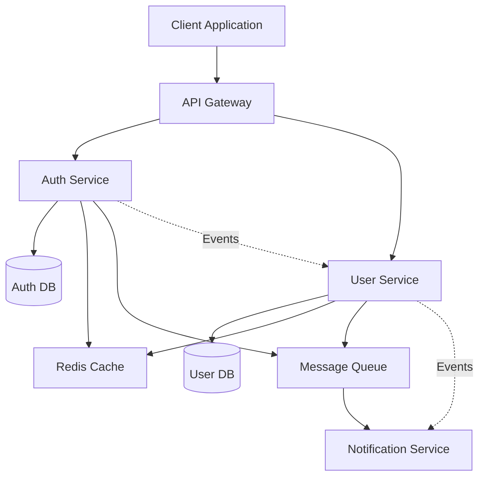

# Integration Plan: {{feature_name}}

## Overview
Integration strategy for microservices implementing {{feature_name}}

## Service Architecture



## Service Communication Matrix

| Source Service | Target Service | Protocol | Pattern | Purpose |
|---------------|---------------|----------|---------|---------|
| API Gateway | Auth Service | REST | Request-Response | Authentication |
| API Gateway | User Service | REST | Request-Response | User operations |
| Auth Service | User Service | Event | Pub-Sub | User created/updated |
| User Service | Notification | Event | Pub-Sub | Send notifications |
| All Services | Cache | Redis | Cache-Aside | Performance |

## Integration Points

### 1. Authentication Flow
**Services**: API Gateway → Auth Service → User Service

**Flow**:
1. Client sends credentials to API Gateway
2. Gateway forwards to Auth Service
3. Auth Service validates and generates token
4. Auth Service publishes `user.authenticated` event
5. User Service updates last login timestamp
6. Token returned to client

**Contracts**:
- REST API: `POST /auth/login`
- Event: `user.authenticated`
- Response: JWT token

### 2. User Registration Flow
**Services**: API Gateway → User Service → Auth Service → Notification Service

**Flow**:
1. Client sends registration data to API Gateway
2. Gateway forwards to User Service
3. User Service creates user record
4. User Service publishes `user.created` event
5. Auth Service creates authentication record
6. Notification Service sends welcome email
7. Confirmation sent to client

**Contracts**:
- REST API: `POST /users/register`
- Events: `user.created`, `auth.created`, `notification.sent`

### 3. Data Synchronization
**Services**: All services with shared data

**Strategy**:
- Event-driven synchronization
- Eventual consistency model
- Compensation for failures

**Events**:
- `user.updated` - Profile changes
- `auth.revoked` - Token invalidation
- `permission.changed` - Authorization updates

## API Gateway Configuration

### Routing Rules
```yaml
routes:
  - path: /api/v1/auth/*
    service: auth-service
    methods: [GET, POST, PUT, DELETE]

  - path: /api/v1/users/*
    service: user-service
    methods: [GET, POST, PUT, DELETE]

  - path: /api/v1/notifications/*
    service: notification-service
    methods: [GET, POST]
```

### Security Policies
- Rate limiting: 100 requests/minute per IP
- Authentication: JWT validation
- CORS: Configured for allowed origins
- Request/Response validation

## Message Queue Configuration

### Exchanges and Queues
```yaml
exchanges:
  - name: user-events
    type: topic
    durable: true

  - name: auth-events
    type: topic
    durable: true

queues:
  - name: user-service-queue
    bindings:
      - exchange: auth-events
        routing_key: auth.*

  - name: notification-queue
    bindings:
      - exchange: user-events
        routing_key: user.*
```

### Event Schema
```json
{
  "eventId": "uuid",
  "eventType": "user.created",
  "timestamp": "ISO-8601",
  "correlationId": "uuid",
  "data": {
    "userId": "uuid",
    "email": "string"
  }
}
```

## Service Discovery

### Registration
- Each service registers on startup
- Health checks every 30 seconds
- Deregistration on shutdown

### Discovery
- Service-to-service calls use discovery
- Client-side load balancing
- Circuit breaker implementation

## Error Handling Strategy

### Retry Logic
- Exponential backoff: 1s, 2s, 4s, 8s
- Max retries: 3
- Dead letter queue for failures

### Circuit Breaker
- Threshold: 50% failure rate
- Window: 60 seconds
- Half-open attempts: Every 30 seconds

### Compensation
- Saga pattern for distributed transactions
- Compensation events for rollback
- Audit log for all operations

## Testing Strategy

### Integration Tests
1. **Service-to-Service**: Mock external dependencies
2. **End-to-End**: Full flow testing
3. **Contract Tests**: API and event contracts
4. **Chaos Testing**: Failure scenarios

### Test Scenarios
- [ ] Happy path: Complete user registration
- [ ] Service failure: Auth service down
- [ ] Network partition: Queue unreachable
- [ ] Data consistency: Concurrent updates
- [ ] Performance: High load conditions

## Monitoring and Observability

### Distributed Tracing
- Correlation IDs across all services
- Request flow visualization
- Performance bottleneck identification

### Metrics
- Request rate per service
- Error rate per integration point
- Message queue depth
- Cache hit ratio

### Alerting
- Service unavailable > 1 minute
- Error rate > 5%
- Queue depth > 1000 messages
- Response time > 500ms (p95)

## Security Considerations

### Service-to-Service Authentication
- mTLS for internal communication
- Service accounts with limited scope
- Regular key rotation

### Data Protection
- Encryption in transit (TLS)
- Encryption at rest (database)
- PII masking in logs

## Deployment Strategy

### Order of Deployment
1. Infrastructure (Database, Cache, Queue)
2. Core services (Auth, User)
3. Support services (Notification)
4. API Gateway
5. Monitoring and logging

### Rollback Plan
- Blue-green deployment
- Database migration rollback scripts
- Event replay capability
- Configuration rollback

## Performance Optimization

### Caching Strategy
- User profiles: 5 minutes TTL
- Authentication tokens: Until expiry
- Permissions: 1 minute TTL

### Database Optimization
- Read replicas for queries
- Connection pooling
- Query optimization
- Proper indexing

### Async Processing
- Non-critical operations queued
- Batch processing where possible
- Event debouncing

## Timeline

| Phase | Duration | Tasks |
|-------|----------|-------|
| Setup | 2 days | Infrastructure, service discovery |
| Core Integration | 5 days | Auth + User services |
| Extended Integration | 3 days | Notification, monitoring |
| Testing | 3 days | Integration tests, load tests |
| Optimization | 2 days | Performance tuning |

## Success Criteria

- [ ] All services communicating successfully
- [ ] End-to-end flows working
- [ ] Performance targets met
- [ ] Monitoring in place
- [ ] Security scans passed
- [ ] Documentation complete
- [ ] Team trained on operations