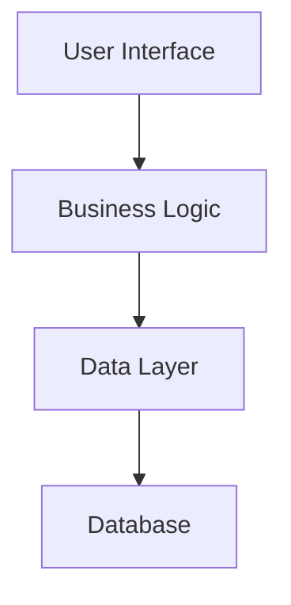

# Implementation Plan: {{feature_name}}

## Specification Reference
- **Spec ID**: SPEC-{{spec_id}}
- **Generated**: {{date}}
- **Optimization Focus**: {{optimization_focus}}

## Architecture Overview

## Phase -1: Pre-Implementation Gates
**SDD Compliance Check** - Must pass before coding:
- [ ] Specification First - Complete spec with no ambiguities
- [ ] Incremental Planning - Phases clearly defined
- [ ] Task Decomposition - Tasks are concrete and executable
- [ ] Quality Assurance - Testing strategy defined
- [ ] Architecture Documentation - Technical decisions recorded

## Phase 0: Foundation
### Objectives
- Set up project structure
- Configure development environment
- Initialize core components

### Tasks
- [ ] Create project scaffolding
- [ ] Set up dependencies
- [ ] Configure build system
- [ ] Initialize testing framework

### Success Criteria
- Development environment operational
- All team members can build and run
- Basic CI/CD pipeline functional

## Phase 1: Core Implementation
### Objectives
- Implement primary functionality
- Create essential features
- Establish data models

### Tasks
- [ ] Implement data models
- [ ] Create core business logic
- [ ] Build primary API endpoints
- [ ] Develop basic UI components

### Success Criteria
- Core features working end-to-end
- Unit tests passing
- Integration tests defined

## Phase 2: Enhancement
### Objectives
- Add secondary features
- Improve user experience
- Optimize performance

### Tasks
- [ ] Implement additional features
- [ ] Add error handling
- [ ] Optimize database queries
- [ ] Enhance UI/UX

### Success Criteria
- All features implemented
- Performance targets met
- Error handling comprehensive

## Phase 3: Polish & Deploy
### Objectives
- Final testing and bug fixes
- Documentation completion
- Production deployment

### Tasks
- [ ] Complete integration testing
- [ ] Fix identified bugs
- [ ] Write user documentation
- [ ] Deploy to production

### Success Criteria
- All tests passing
- Documentation complete
- Successfully deployed

## Technical Decisions

### Architecture Pattern
- **Pattern**: {{architecture_pattern}}
- **Rationale**: [Why this pattern was chosen]

### Technology Stack
- **Frontend**: {{frontend_stack}}
- **Backend**: {{backend_stack}}
- **Database**: {{database}}
- **Infrastructure**: {{infrastructure}}

### Key Design Decisions
1. **Decision 1**: [Description and rationale]
2. **Decision 2**: [Description and rationale]
3. **Decision 3**: [Description and rationale]

## Risk Management

### Identified Risks
1. **Risk**: [Description]
   - **Probability**: [High|Medium|Low]
   - **Impact**: [High|Medium|Low]
   - **Mitigation**: [Strategy]

2. **Risk**: [Description]
   - **Probability**: [High|Medium|Low]
   - **Impact**: [High|Medium|Low]
   - **Mitigation**: [Strategy]

## Resource Requirements
- **Team Size**: {{team_size}}
- **Timeline**: {{timeline}}
- **Budget**: {{budget}}
- **Tools**: {{required_tools}}

## Dependencies
- External services required
- Third-party libraries
- Other team deliverables

## Monitoring & Success Metrics
- Performance metrics to track
- Business metrics to measure
- Quality metrics to monitor

## Notes
<!-- Additional implementation notes -->