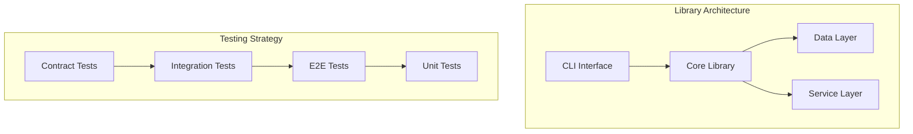

<!-- SpecPulse Implementation Plan Template v3.0 -->
<!-- AI Instructions: Generate plan from specification following SDD methodology -->

# Implementation Plan: [FEATURE_NAME]

## Specification Reference
- **Spec ID**: SPEC-[XXX]
- **Branch**: [feature-branch-name]
- **Generated**: [DATE]
- **Optimization Focus**: [PERFORMANCE|SECURITY|SIMPLICITY|COST]

## Phase -1: Pre-Implementation Gates

### Constitutional Compliance Check
**THIS SECTION MUST BE COMPLETED BEFORE ANY IMPLEMENTATION**

#### Simplicity Gate (Article VII)
- [ ] Using ≤3 projects/modules for initial implementation?
- [ ] No future-proofing without documented need?
- [ ] Direct framework usage (no unnecessary wrappers)?
- [ ] Single model representation per concept?

**If any checkbox is unchecked, document in Complexity Tracking below**

#### Anti-Abstraction Gate (Article VII)
- [ ] Using framework features directly?
- [ ] No unnecessary abstraction layers?
- [ ] Clear, simple interfaces?
- [ ] Avoiding premature optimization?

#### Test-First Gate (Article III)
- [ ] Test specifications written?
- [ ] Tests reviewed and approved?
- [ ] Tests confirmed to FAIL before implementation?
- [ ] TDD cycle planned (Red-Green-Refactor)?

#### Integration-First Gate (Article VIII)
- [ ] Contract tests defined?
- [ ] Using real services over mocks?
- [ ] Production-like test environment planned?
- [ ] End-to-end test scenarios identified?

#### Research Gate (Article VI)
- [ ] Library options researched?
- [ ] Performance implications documented?
- [ ] Security considerations analyzed?
- [ ] Trade-offs documented in research.md?

**Gate Status**: [ ] PASSED / [ ] BLOCKED (See Complexity Tracking)

## Complexity Tracking

### Justified Exceptions
```yaml
complexity_exceptions:
  # Example:
  # - article: VII
  #   violation: "Using 4 modules instead of 3"
  #   justification: "Authentication requires separate service for security isolation"
  #   approved_by: "[Approver]"
  #   date: "[DATE]"
```

### Simplification Opportunities
- [ ] Areas identified for future simplification
- [ ] Technical debt documented
- [ ] Refactoring planned for Phase X

## Research Summary
**[Link to detailed research.md]**

### Library Selection
| Purpose | Options Evaluated | Selected | Rationale |
|---------|------------------|----------|-----------|
| [Need] | [Option1, Option2] | [Choice] | [Why] |

### Performance Analysis
- Expected load: [metrics]
- Bottlenecks identified: [list]
- Optimization strategy: [approach]

### Security Considerations
- Attack vectors considered: [list]
- Mitigations planned: [list]
- Compliance requirements: [list]

## Architecture Overview

### Library-First Design (Article I)
```
[feature-name]-lib/
├── cli/              # CLI interface (Article II)
│   └── main.py       # Text in/out, JSON support
├── core/             # Core library logic
│   ├── __init__.py   # Public API
│   └── [modules]/    # Internal modules
├── tests/            # Test-First (Article III)
│   ├── contracts/    # Contract tests first
│   ├── integration/  # Integration tests second
│   ├── e2e/         # End-to-end tests third
│   └── unit/        # Unit tests last
└── docs/            # Executable documentation (Article IX)
```

### System Architecture


## Technology Stack

### Core Technologies (Justified per Article VI)
- **Language**: [Choice] - [Research-backed rationale]
- **Framework**: [Choice] - [Why not alternatives]
- **Database**: [Choice] - [Performance/scale rationale]
- **Testing**: [Choice] - [Integration capability rationale]

### Complexity Budget (Article VII)
- Module 1: [Purpose]
- Module 2: [Purpose]
- Module 3: [Purpose] (if needed)
- **Total Modules**: [2-3] ✓

## Implementation Phases

### Phase 0: Test Infrastructure Setup
**Duration**: [Estimate]
**Gate**: Must pass all Article III requirements

1. **Setup Test Environment**
   - [ ] Real database instance (not mocks)
   - [ ] Service dependencies running
   - [ ] Production-like configuration

2. **Write Contract Tests** (Article VIII priority)
   ```python
   # contracts/test_api_contract.py
   def test_api_contract_failing():
       """This test MUST fail initially per Article III"""
       assert False  # Red phase
   ```

3. **Write Integration Tests**
   ```python
   # integration/test_service_integration.py
   def test_service_integration_failing():
       """Test service with real dependencies"""
       assert False  # Red phase
   ```

### Phase 1: Library Core Implementation
**Duration**: [Estimate]
**Gate**: All tests from Phase 0 must be failing

1. **CLI Interface** (Article II)
   ```python
   # cli/main.py structure
   def main():
       """Accept text input, produce text output"""
       pass
   ```

2. **Core Library** (Article I)
   - [ ] Minimal implementation to pass first test
   - [ ] No premature optimization
   - [ ] Direct framework usage

3. **Make Tests Pass** (Green phase)
   - [ ] Contract tests passing
   - [ ] Integration tests passing
   - [ ] Refactor while green

### Phase 2: Feature Completion
**Duration**: [Estimate]
**Gate**: Core tests passing, ready for features

1. **User Story Implementation**
   - [ ] Story 1: [Title] - Tests first, then code
   - [ ] Story 2: [Title] - Tests first, then code
   - [ ] Story 3: [Title] - Tests first, then code

2. **End-to-End Testing**
   - [ ] Critical path tests with real services
   - [ ] Performance benchmarks
   - [ ] Security scenarios

### Phase 3: Production Readiness
**Duration**: [Estimate]
**Gate**: All acceptance criteria met

1. **Documentation** (Article IX - Executable)
   ```markdown
   # Quick Start (executable)
   $ pip install feature-lib
   $ feature-cli --help
   $ echo "input" | feature-cli process
   ```

2. **Observability**
   - [ ] Logging with structure
   - [ ] Metrics exposed
   - [ ] Health checks

3. **Deployment**
   - [ ] CI/CD pipeline
   - [ ] Rollback capability
   - [ ] Feature flags

## Test-First Development Plan

### Test Execution Order (Article III & VIII)
1. **Contract Tests** → Define boundaries
2. **Integration Tests** → Verify interactions
3. **E2E Tests** → Validate workflows
4. **Unit Tests** → Isolate logic

### Test Coverage Requirements
- Contract Tests: 100% of API surface
- Integration Tests: 100% of service interactions
- E2E Tests: 100% of critical paths
- Unit Tests: 80% of business logic

### Example Test Structure
```python
# Step 1: Write failing test (Red)
def test_feature_behavior():
    result = feature.process("input")
    assert result == "expected"  # Fails

# Step 2: Implement minimum to pass (Green)
def process(input):
    return "expected"  # Passes

# Step 3: Refactor (Refactor)
def process(input):
    # Clean, maintainable implementation
    return transform(validate(input))
```

## API Contracts (Article VIII - Contract First)

### Contract: [Feature API]
```yaml
# contracts/feature-api.yaml
openapi: 3.0.0
paths:
  /process:
    post:
      request:
        required: true
        content:
          text/plain:
            schema:
              type: string
      responses:
        '200':
          content:
            application/json:
              schema:
                type: object
```

### Contract Test
```python
# contracts/test_feature_contract.py
def test_process_contract():
    """Verify API contract compliance"""
    response = client.post("/process", data="input")
    assert response.status_code == 200
    assert "result" in response.json()
```

## Data Models (Simple per Article VII)

### Primary Entity
```python
# Single, simple model - no premature abstraction
@dataclass
class Feature:
    id: str
    data: str
    created_at: datetime
    
    def process(self) -> str:
        """Direct, simple processing"""
        return self.data.upper()  # No unnecessary layers
```

## Risk Mitigation

### Complexity Risks (Article VII)
| Risk | Mitigation |
|------|------------|
| Over-engineering | Phase gates enforce simplicity |
| Premature optimization | Start simple, measure first |
| Abstraction creep | Direct framework usage required |

### Testing Risks (Article III)
| Risk | Mitigation |
|------|------------|
| Skipping TDD | Gates require failing tests first |
| Mock overuse | Real services required |
| Low coverage | Coverage gates enforced |

## Success Criteria

### Constitutional Compliance
- [ ] All Phase Gates passed
- [ ] Complexity exceptions documented
- [ ] Test-First cycle followed
- [ ] Library-First architecture

### Functional Completion
- [ ] All user stories implemented
- [ ] Acceptance criteria met
- [ ] Contract tests passing
- [ ] E2E scenarios validated

### Quality Metrics
- [ ] Test coverage > 80%
- [ ] Performance targets met
- [ ] Security audit passed
- [ ] Documentation executable

## Continuous Refinement (Article V)

### Specification Feedback Loop
- [ ] Implementation discoveries documented
- [ ] Specification updated with learnings
- [ ] [NEEDS CLARIFICATION] items resolved
- [ ] Future improvements noted

### Post-Implementation Review
- [ ] Complexity assessment
- [ ] Simplification opportunities
- [ ] Architecture decisions validated
- [ ] Constitution compliance verified

---
**Note**: This plan is a living document. Update it as implementation progresses and learnings emerge.