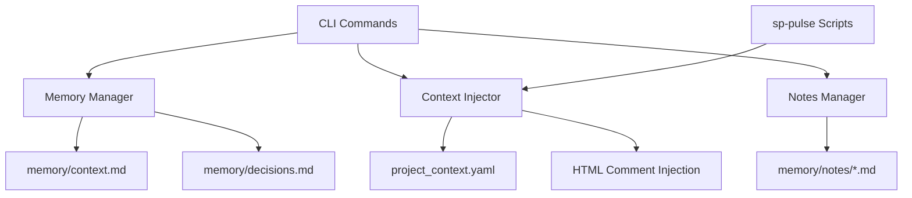

# Implementation Plan: Better Context for LLMs (v1.7.0)

## Specification Reference
- **Spec ID**: SPEC-001
- **Spec Version**: 1.7.0
- **Plan Version**: 002
- **Generated**: 2025-10-06
- **Optimization Focus**: Developer experience, LLM context management, zero-friction note capture

## Architecture Overview

## Phase -1: Pre-Implementation Gates
**SDD Compliance Check** - Must pass before coding:
- [x] Specification First - Complete spec-001.md with clear requirements and acceptance criteria
- [x] Incremental Planning - 3 phases defined: Structured Memory → Context Injection → Quick Notes
- [x] Task Decomposition - 17 functional requirements broken into concrete tasks
- [x] Quality Assurance - 95%+ test coverage requirement, pytest framework
- [x] Architecture Documentation - File structure, formats, and migration strategy documented

## Phase 0: Foundation & Setup

### Objectives
- Set up new module structure for memory management
- Create data models and parsers for structured memory
- Establish backward compatibility layer

### Tasks
- [ ] **T0.1**: Create `specpulse/core/memory_manager.py` module (Simple)
  - Memory tag parser (decision, pattern, current, constraint)
  - Entry model: MemoryEntry(id, title, content, tags, date, related_features)
  - Query interface: query_by_tag(), query_by_feature(), get_recent()

- [ ] **T0.2**: Create `specpulse/core/context_injector.py` module (Simple)
  - ContextInjector class with inject() method
  - Template for HTML comment format
  - Integration point for sp-pulse scripts

- [ ] **T0.3**: Create `specpulse/core/notes_manager.py` module (Simple)
  - NotesManager class
  - Note model: Note(id, content, feature, timestamp)
  - CRUD operations for notes

- [ ] **T0.4**: Create `specpulse/models/project_context.py` (Simple)
  - ProjectContext dataclass
  - YAML serialization/deserialization
  - Validation for tech stack format

- [ ] **T0.5**: Set up test fixtures for memory formats (Simple)
  - Sample context.md with tags
  - Sample project_context.yaml
  - Sample notes files

### Success Criteria
- All core modules created with type hints and docstrings
- Unit tests passing for basic CRUD operations
- Data models validated with pytest

## Phase 1: Structured Memory System

### Objectives
- Implement tag-based memory system
- Create CLI commands for memory management
- Migrate existing context.md files to structured format

### Tasks

#### Memory Manager Implementation
- [ ] **T1.1**: Implement MemoryManager.add_decision() (Medium)
  - Add decision entry with title, rationale, date, related features
  - Format: `### DEC-{id}: {title}\nRationale: ...\nDate: ...\nRelated: ...`
  - Append to memory/context.md under `## Decisions [tag:decision]`
  - Auto-increment decision ID

- [ ] **T1.2**: Implement MemoryManager.add_pattern() (Medium)
  - Add pattern entry with title, example, features used
  - Format: `### PATTERN-{id}: {title}\n{example}\nUsed in: ...\nDate: ...`
  - Append to memory/context.md under `## Patterns [tag:pattern]`
  - Auto-increment pattern ID

- [ ] **T1.3**: Implement MemoryManager.add_constraint() (Simple)
  - Add constraint entry with title, description, scope
  - Format: `### CONST-{id}: {title}\n{description}\nApplies to: ...\nDate: ...`
  - Append to memory/context.md under `## Constraints [tag:constraint]`

- [ ] **T1.4**: Implement MemoryManager.query_by_tag() (Medium)
  - Parse context.md and extract entries by tag
  - Support tag filters: decision, pattern, current, constraint
  - Return list of MemoryEntry objects
  - Performance: < 100ms for 1000 entries

- [ ] **T1.5**: Implement MemoryManager.query_relevant() (Complex)
  - Given feature ID, find all related memory entries
  - Check "Related:" field for feature mentions
  - Include patterns used in related features
  - Include current active context
  - Return consolidated MemoryEntry list

#### CLI Commands for Memory
- [ ] **T1.6**: Implement `specpulse memory add-decision` command (Medium)
  - Arguments: title (required), --rationale (required), --feature (optional)
  - Calls MemoryManager.add_decision()
  - Output: Success message with decision ID

- [ ] **T1.7**: Implement `specpulse memory add-pattern` command (Medium)
  - Arguments: title (required), --example (required), --features (optional)
  - Calls MemoryManager.add_pattern()
  - Output: Success message with pattern ID

- [ ] **T1.8**: Implement `specpulse memory query` command (Medium)
  - Arguments: --tag (decision|pattern|current|constraint)
  - Optional: --feature, --recent (number)
  - Calls MemoryManager.query_by_tag()
  - Output: Formatted table with results using Rich

- [ ] **T1.9**: Implement `specpulse memory relevant` command (Simple)
  - Arguments: feature_id (e.g., "001")
  - Calls MemoryManager.query_relevant()
  - Output: Markdown-formatted context for LLM

#### Migration & Backward Compatibility
- [ ] **T1.10**: Implement auto-migration for old context.md (Complex)
  - Detect unstructured context.md (missing tag headers)
  - Create backup: context.md.backup.{timestamp}
  - Parse and categorize existing content
  - Restructure with tag headers
  - Preserve all original content

- [ ] **T1.11**: Add migration validation (Medium)
  - Compare pre/post migration content
  - Ensure no data loss
  - Report migration summary
  - Allow rollback if needed

### Success Criteria
- All memory CLI commands functional
- Can add/query decisions, patterns, constraints
- Auto-migration tested on 3+ real projects
- Query performance < 100ms
- 95%+ test coverage for MemoryManager

## Phase 2: Context Injection System

### Objectives
- Implement project context YAML storage
- Create context injection API
- Update all sp-pulse scripts to auto-inject context

### Tasks

#### Project Context Management
- [ ] **T2.1**: Implement ProjectContext.load() (Simple)
  - Read from .specpulse/project_context.yaml
  - Parse YAML into ProjectContext model
  - Handle missing file gracefully (return defaults)

- [ ] **T2.2**: Implement ProjectContext.save() (Simple)
  - Serialize ProjectContext to YAML
  - Write to .specpulse/project_context.yaml
  - Create directory if needed

- [ ] **T2.3**: Implement `specpulse context set` command (Medium)
  - Arguments: key value (e.g., "tech_stack.frontend" "React")
  - Support nested keys with dot notation
  - Call ProjectContext.save()
  - Output: Confirmation message

- [ ] **T2.4**: Implement `specpulse context get` command (Simple)
  - Arguments: key (optional, shows all if omitted)
  - Call ProjectContext.load()
  - Output: Formatted YAML or specific value

- [ ] **T2.5**: Implement `specpulse context auto-detect` command (Complex)
  - Scan for: package.json, pyproject.toml, composer.json, Gemfile
  - Extract: language, frameworks, dependencies
  - Auto-populate tech_stack fields
  - Prompt user to confirm/edit detected values

#### Context Injection Implementation
- [ ] **T2.6**: Implement ContextInjector.build_context() (Medium)
  - Load ProjectContext
  - Get recent decisions (last 3) from MemoryManager
  - Get active patterns from MemoryManager
  - Format into compact HTML comment block
  - Keep total size < 500 characters

- [ ] **T2.7**: Implement `specpulse context inject` command (Simple)
  - Optional: --feature (for feature-specific context)
  - Call ContextInjector.build_context()
  - Output: HTML comment block ready for copy-paste

- [ ] **T2.8**: Update sp-pulse-init.sh to inject context (Medium)
  - Call `specpulse context inject` at script start
  - Prepend context to template before rendering
  - Ensure context appears in generated spec

- [ ] **T2.9**: Update sp-pulse-spec.sh to inject context (Medium)
  - Call `specpulse context inject --feature $FEATURE_DIR`
  - Include feature-specific patterns and decisions
  - Prepend context to prompt

- [ ] **T2.10**: Update sp-pulse-plan.sh to inject context (Medium)
  - Call `specpulse context inject --feature $FEATURE_DIR`
  - Include architectural decisions
  - Prepend context to prompt

- [ ] **T2.11**: Update sp-pulse-task.sh to inject context (Medium)
  - Call `specpulse context inject --feature $FEATURE_DIR`
  - Include patterns and constraints
  - Prepend context to prompt

- [ ] **T2.12**: Update sp-pulse-decompose.sh to inject context (Medium)
  - Call `specpulse context inject --feature $FEATURE_DIR`
  - Include architectural patterns
  - Prepend context to prompt

### Success Criteria
- Project context YAML operational
- Context injection working in all sp-pulse scripts
- Injected context size < 500 characters
- Auto-detection works for common package managers
- 95%+ test coverage for ContextInjector

## Phase 3: Quick Notes System

### Objectives
- Implement lightweight note-taking
- Create notes CLI commands
- Build merge-to-spec functionality

### Tasks

#### Notes Manager Implementation
- [ ] **T3.1**: Implement NotesManager.add_note() (Simple)
  - Arguments: content, feature_id (optional)
  - Create memory/notes/{feature_id}.md if needed
  - Append note with timestamp
  - Return note ID

- [ ] **T3.2**: Implement NotesManager.list_notes() (Simple)
  - Arguments: feature_id (optional)
  - Read from memory/notes/{feature_id}.md
  - Parse notes with IDs and timestamps
  - Return list of Note objects

- [ ] **T3.3**: Implement NotesManager.merge_to_spec() (Complex)
  - Arguments: feature_id, note_id, section (optional)
  - Read note content
  - Find latest spec file in specs/{feature_id}/
  - Determine appropriate section (or use provided)
  - Insert note content with proper formatting
  - Mark note as merged in notes file

#### Notes CLI Commands
- [ ] **T3.4**: Implement `specpulse note` command (Simple)
  - Arguments: message (required), --feature (optional)
  - Auto-detect current feature from context.md if not provided
  - Call NotesManager.add_note()
  - Output: Confirmation with note ID

- [ ] **T3.5**: Implement `specpulse notes list` command (Simple)
  - Arguments: feature_id (optional)
  - Call NotesManager.list_notes()
  - Output: Formatted table with IDs, timestamps, content preview

- [ ] **T3.6**: Implement `specpulse notes merge` command (Medium)
  - Arguments: feature_id, --note (note_id), --section (optional)
  - Call NotesManager.merge_to_spec()
  - Output: Success message with spec file updated

- [ ] **T3.7**: Add notes preview in `specpulse status` (Simple)
  - Show unmerged notes count for current feature
  - Quick preview of latest 3 notes
  - Prompt to run `specpulse notes list` for full list

### Success Criteria
- Can add notes with single command
- Notes listed with timestamps
- Merge-to-spec working for all spec sections
- Notes associated with correct features
- 95%+ test coverage for NotesManager

## Phase 4: Integration & Polish

### Objectives
- End-to-end testing of all features
- Documentation updates
- Performance optimization

### Tasks

#### Integration Testing
- [ ] **T4.1**: Create integration test for full workflow (Complex)
  - Initialize project → Add context → Create feature → Add decision → Generate spec
  - Verify context auto-injected
  - Add note → Merge to spec
  - Validate spec contains note and context

- [ ] **T4.2**: Test migration on real projects (Medium)
  - Test on 3+ existing SpecPulse projects
  - Verify no data loss
  - Check backward compatibility
  - Document any edge cases

- [ ] **T4.3**: Performance benchmarking (Medium)
  - Measure memory query time (target < 100ms)
  - Measure context injection time (target < 50ms)
  - Measure note creation time (target < 10ms)
  - Optimize slow operations

#### Documentation
- [ ] **T4.4**: Update help system (Medium)
  - Add help topics: memory, context, notes
  - Create `specpulse help memory-management`
  - Update command descriptions
  - Add examples to help output

- [ ] **T4.5**: Update ROADMAP.md (Simple)
  - Mark v1.7.0 as completed
  - Add implementation notes
  - Link to relevant files

- [ ] **T4.6**: Update README.md (Simple)
  - Add v1.7.0 features to feature list
  - Update usage examples
  - Add memory/context/notes sections

#### Polish
- [ ] **T4.7**: Add rich console output (Simple)
  - Color-coded memory query results
  - Progress bars for migration
  - Animated spinners for context injection
  - Tables for notes list

- [ ] **T4.8**: Error handling and validation (Medium)
  - Validate YAML syntax in project_context.yaml
  - Handle missing memory files gracefully
  - Validate feature IDs exist
  - User-friendly error messages

- [ ] **T4.9**: Add `specpulse doctor` checks (Simple)
  - Check memory file size (warn if > 1MB)
  - Check for unmerged notes
  - Validate project_context.yaml
  - Check context injection in scripts

### Success Criteria
- All integration tests passing
- Documentation complete and accurate
- Performance targets met
- Error handling comprehensive
- Rich console output implemented

## Technical Decisions

### Architecture Pattern
- **Pattern**: Module-based architecture with CLI facade
- **Rationale**:
  - MemoryManager, ContextInjector, NotesManager are independent modules
  - CLI layer delegates to core modules
  - Enables unit testing without CLI overhead
  - Future API/web interface can reuse core modules

### Technology Stack
- **Language**: Python 3.11+
- **CLI Framework**: Click (existing)
- **Console Output**: Rich (existing)
- **Data Format**: Markdown (memory), YAML (config)
- **Testing**: pytest with coverage
- **Type Checking**: mypy with strict mode

### Key Design Decisions

1. **Decision: Use Tags in Markdown Headers**
   - **Rationale**: Human-readable, git-friendly, no database needed. Tags like `[tag:decision]` are searchable via grep and parseable programmatically.
   - **Alternative Considered**: YAML frontmatter - rejected for verbosity
   - **Trade-off**: Parsing complexity vs. readability (chose readability)

2. **Decision: HTML Comments for Context Injection**
   - **Rationale**: Invisible to users in rendered markdown, visible to LLMs in raw text. Doesn't clutter spec files.
   - **Alternative Considered**: YAML frontmatter - rejected as it's visible to users
   - **Trade-off**: Hidden metadata vs. user visibility (chose hidden)

3. **Decision: Single context.md File with Archiving**
   - **Rationale**: Keeps structure simple, easier to search. Archiving prevents unbounded growth.
   - **Alternative Considered**: Multiple files per feature - rejected for discovery complexity
   - **Trade-off**: File size vs. discoverability (chose discoverability with archiving)

4. **Decision: YAML for Project Context**
   - **Rationale**: Structured, supports nesting, easy to edit. Standard format for config.
   - **Alternative Considered**: TOML - rejected for lack of nesting support
   - **Trade-off**: Format familiarity vs. flexibility (chose flexibility)

5. **Decision: Notes per Feature vs. Global Notes**
   - **Rationale**: Feature-scoped notes are easier to find and merge. Prevents note pollution across features.
   - **Alternative Considered**: Single notes.md file - rejected for organization
   - **Trade-off**: File count vs. organization (chose organization)

## Risk Management

### Identified Risks

1. **Risk**: Breaking existing projects during migration
   - **Probability**: Medium
   - **Impact**: High (data loss)
   - **Mitigation**:
     - Auto-backup before migration (context.md.backup.{timestamp})
     - Dry-run mode for migration testing
     - Rollback command if migration fails
     - Extensive testing on real projects

2. **Risk**: Memory file growth exceeding 1MB
   - **Probability**: Medium
   - **Impact**: Low (slow queries)
   - **Mitigation**:
     - Archive entries older than 6 months
     - `specpulse memory archive` command
     - Warning in `specpulse doctor` when > 500KB
     - Documentation on cleanup strategies

3. **Risk**: Context injection adds too much noise
   - **Probability**: Low
   - **Impact**: Medium (LLM distraction)
   - **Mitigation**:
     - Strict 500 character limit
     - Only inject most recent 3 decisions
     - User can disable with `--no-context` flag
     - HTML comments are collapsible in editors

4. **Risk**: Cross-platform script compatibility issues
   - **Probability**: Low
   - **Impact**: Medium (Windows users blocked)
   - **Mitigation**:
     - Test on Windows (Git Bash), Linux, macOS
     - Use Python for context injection (not bash)
     - PowerShell equivalents for Windows users
     - CI/CD tests on all platforms

5. **Risk**: Performance degradation with 1000+ entries
   - **Probability**: Low
   - **Impact**: Low (slower queries)
   - **Mitigation**:
     - Implement caching for repeated queries
     - Index by tag during parsing
     - Benchmark with 1000+ entry fixtures
     - Optimize if query time > 100ms

## Resource Requirements
- **Team Size**: 1 developer (solo)
- **Timeline**: 2 weeks
  - Week 1: Phases 0-2 (Foundation, Memory, Context)
  - Week 2: Phases 3-4 (Notes, Integration, Polish)
- **Tools**:
  - Python 3.11+ development environment
  - pytest for testing
  - mypy for type checking
  - Rich for console output
  - Git Bash for Windows testing

## Dependencies

### Internal Dependencies
- `specpulse/core/validator.py` - for spec validation when merging notes
- `specpulse/utils/console.py` - for rich output in memory/notes commands
- `specpulse/utils/git_utils.py` - for detecting current branch/feature
- `resources/scripts/sp-pulse-*.sh` - all scripts need context injection updates

### External Dependencies (Existing)
- `click>=8.0` - CLI framework
- `rich>=13.0` - Console output
- `pyyaml>=6.0` - YAML parsing
- `jinja2>=3.0` - Template rendering (for context injection templates)

### New External Dependencies
- None (all functionality uses existing dependencies)

## Monitoring & Success Metrics

### Performance Metrics
- **Memory Query Time**: < 100ms (measured via pytest-benchmark)
- **Context Injection Time**: < 50ms (measured via pytest-benchmark)
- **Note Creation Time**: < 10ms (measured via pytest-benchmark)
- **Migration Time**: < 5 seconds for typical project (< 100 entries)

### Developer Experience Metrics
- **Time to Find Decision**: 2 min (manual search) → 10 sec (query command)
- **LLM Context Questions**: 5-10 questions → 0-2 questions (auto-injected)
- **Context Reload Time**: 30 sec (manual) → 0 sec (auto-injected)
- **Note Capture Time**: 2 min (manual spec edit) → 5 sec (note command)

### Code Quality Metrics
- **Test Coverage**: 95%+ (measured via pytest-cov)
- **Type Hint Coverage**: 100% of public APIs (measured via mypy)
- **Docstring Coverage**: 100% of public functions (manual review)
- **Linting**: 0 errors/warnings (measured via flake8)

### Business Metrics (User Adoption)
- **Feature Usage**: Track CLI command usage via telemetry (opt-in)
- **Migration Success Rate**: 100% (all existing projects migrate without data loss)
- **User Feedback**: Collect via GitHub issues/discussions

## Notes

### Implementation Order Rationale
1. **Phase 0 first** ensures solid foundation with type-safe models
2. **Phase 1 (Memory)** before Phase 2 (Context) because context injection depends on memory queries
3. **Phase 3 (Notes)** last because it depends on spec validation from Phase 1
4. **Phase 4 (Integration)** as final polish ensures end-to-end quality

### Testing Strategy
- **Unit tests**: 95%+ coverage for all core modules (MemoryManager, ContextInjector, NotesManager)
- **Integration tests**: Full workflow from feature init → note merge
- **Migration tests**: Test on 3+ real SpecPulse projects with diverse content
- **Performance tests**: Benchmark with 1000+ entry fixtures using pytest-benchmark
- **Cross-platform tests**: CI/CD on Windows, Linux, macOS

### Edge Cases to Handle
- Empty memory/context.md file
- Malformed YAML in project_context.yaml
- Missing feature directory when adding note
- Concurrent writes to same memory file (file locking)
- Very long note content (>1000 chars) - truncate in list view
- Special characters in note content - escape for markdown safety

### Future Enhancements (Post-v1.7.0)
- [ ] Web UI for memory/context management
- [ ] Memory search with fuzzy matching
- [ ] Graph view of feature relationships
- [ ] Auto-suggest patterns based on feature description
- [ ] Export memory to JSON/CSV for analysis
