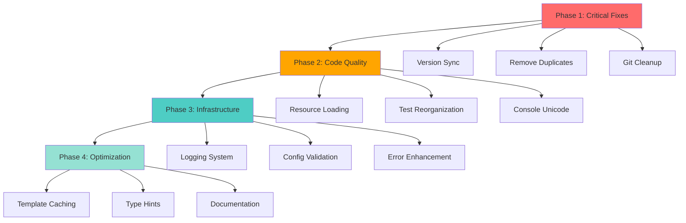

<!-- SpecPulse Implementation Plan Template v1.0 -->
<!-- FEATURE_DIR: 003-project-health-improvements -->
<!-- FEATURE_ID: 003 -->
<!-- PLAN_ID: PLAN-003 -->
<!-- STATUS: draft -->
<!-- CREATED: 2025-10-08 -->

# Implementation Plan: SpecPulse Project Health & Quality Improvements

## Specification Reference
- **Spec ID**: SPEC-003
- **Generated**: 2025-10-08
- **Optimization Focus**: SIMPLICITY & MAINTAINABILITY
- **Target Version**: v2.1.2
- **Estimated Duration**: 12-16 hours (2-3 days with testing)

## Architecture Overview



## Technology Stack

### Core Technologies
- **Language**: Python 3.11+ (existing)
  - Rationale: Already established, good type hint support, modern features
- **Build System**: pyproject.toml (PEP 517/518)
  - Rationale: Modern Python packaging standard
- **Testing**: pytest 7.0+
  - Rationale: Industry standard, excellent fixture support

### Supporting Tools
- **Testing**: pytest, pytest-cov
  - Rationale: Already in use, comprehensive test framework
- **Code Quality**: black, flake8, mypy
  - Rationale: Existing dev dependencies, enforce consistency
- **Logging**: Python stdlib logging module
  - Rationale: No new dependencies, production-ready, configurable

### No New External Dependencies
All improvements use existing dependencies to minimize risk.

## Implementation Phases

### Phase 0: Preparation & Analysis (1 hour)
**Duration**: 1 hour
**Deliverables**:
- Feature branch created (003-project-health-improvements)
- Baseline test coverage report
- Backup of current codebase state
- Development environment validated

**Tasks**:
1. Create feature branch from master
2. Run full test suite and capture coverage baseline
3. Document current metrics (test count, coverage %, startup time)
4. Verify development environment (Python version, pytest, black, mypy)
5. Review spec and plan with team

**Success Criteria**:
- [ ] Branch created and checked out
- [ ] Baseline metrics documented
- [ ] All existing tests passing
- [ ] Development tools installed and working

---

### Phase 1: Critical Packaging & Code Fixes (3 hours)
**Duration**: 3 hours
**Deliverables**:
- Synchronized version strings across all files
- MANIFEST.in cleaned up
- Duplicate method removed
- Git repository cleaned
- .gitignore updated

**Tasks**:

#### Task 1.1: Version String Synchronization (30 min)
- Update setup.py description: "SpecPulse v2.0.0" → "SpecPulse v2.1.2"
- Verify pyproject.toml reads from specpulse._version.__version__
- Update README.md installation command to use latest version
- Grep entire codebase for version string references
- Run: `python setup.py sdist bdist_wheel` to verify

#### Task 1.2: MANIFEST.in Cleanup (15 min)
- Remove line: `recursive-include specpulse/resources/scripts *`
- Verify no other obsolete references
- Test package build includes correct files only
- Document changes in CHANGELOG.md

#### Task 1.3: Dependency Version Pinning (30 min)
- Update pyproject.toml dependencies with upper bounds:
  ```toml
  dependencies = [
      "pyyaml>=6.0,<7.0",
      "click>=8.0,<9.0",
      "rich>=13.0,<14.0",
      "jinja2>=3.0,<4.0",
      "gitpython>=3.1,<4.0",
      "toml>=0.10,<1.0",
      "packaging>=21.0,<25.0",
  ]
  ```
- Test installation with pinned versions
- Verify no conflicts with existing code

#### Task 1.4: Remove Duplicate Method (30 min)
- Locate both `get_decomposition_template()` methods in specpulse/core/specpulse.py
- Compare implementations (lines 495-523 vs 1170-1181)
- Merge into single comprehensive method
- Update all callers if signature changes
- Add unit test for merged method

#### Task 1.5: Git Repository Cleanup (45 min)
- Stage and commit modified command files (.claude/commands/)
- Remove deleted files from git index:
  ```bash
  git rm RELEASE_v2.1.0_COMPLETE.md
  git rm -r scripts/
  ```
- Update .gitignore with missing entries:
  ```
  *.pyc
  __pycache__/
  *.egg-info/
  .specpulse/cache/
  dist/
  build/
  *.log
  ```
- Verify clean git status

#### Task 1.6: Validation & Testing (30 min)
- Run full test suite (pytest)
- Verify package builds: `python setup.py sdist bdist_wheel`
- Check wheel contents: `unzip -l dist/specpulse-*.whl`
- Install in clean virtualenv and test basic commands
- Document Phase 1 completion

**Success Criteria**:
- [ ] All version strings match "2.1.2"
- [ ] Package builds without warnings
- [ ] No duplicate code
- [ ] Git status clean (all changes committed)
- [ ] All tests still passing

---

### Phase 2: Code Quality Improvements (4 hours)
**Duration**: 4 hours
**Deliverables**:
- Simplified resource loading with specific exceptions
- Reorganized test structure
- Cross-platform Unicode console handling
- Type hints added to CLI module

**Tasks**:

#### Task 2.1: Simplify Resource Loading (1.5 hours)
- Refactor specpulse/core/specpulse.py:__init__ (lines 17-51)
- Replace 4 fallback methods with single clean approach:
  ```python
  from importlib.resources import files

  try:
      resource_anchor = files('specpulse')
      self.resources_dir = Path(str(resource_anchor / 'resources'))
  except (ImportError, TypeError, AttributeError) as e:
      # Development mode fallback only
      self.resources_dir = Path(__file__).parent.parent / "resources"
      if not self.resources_dir.exists():
          raise ResourceError("resources", self.resources_dir) from e
  ```
- Remove all bare `except:` blocks
- Add ResourceError class to error_handler.py
- Test in: virtualenv, conda, system Python, dev mode (pip install -e)
- Write unit tests for both paths (installed + dev mode)

#### Task 2.2: Test Suite Reorganization (1.5 hours)
- Create new directory structure:
  ```
  tests/
  ├── unit/
  ├── integration/
  ├── performance/
  └── conftest.py
  ```
- Categorize and move existing tests:
  - Unit tests → tests/unit/ (test_console, test_validator, etc.)
  - Integration tests → tests/integration/ (test_v170_workflow, etc.)
  - Performance tests → tests/performance/ (test_v170_performance, etc.)
- Identify and consolidate duplicates:
  - Merge test_complete_100.py, test_coverage_100.py, test_final_100.py
  - Delete test_cli_fixed.py if superseded by test_cli.py
- Update pytest.ini_options in pyproject.toml if needed
- Run full test suite to verify all tests still execute
- Generate coverage report and compare to baseline

#### Task 2.3: Console Unicode Handling (45 min)
- Modify specpulse/utils/console.py:
  ```python
  class Console:
      def __init__(self, no_color: bool = False, verbose: bool = False):
          self.no_color = no_color
          self.verbose = verbose
          self.use_emoji = self._check_emoji_support()

      def _check_emoji_support(self) -> bool:
          """Auto-detect emoji support"""
          import sys, os
          if sys.platform == 'win32':
              return 'WT_SESSION' in os.environ
          return True

      def _emoji_or_text(self, emoji: str, text: str) -> str:
          """Return emoji if supported, otherwise text"""
          return emoji if self.use_emoji else text
  ```
- Replace all direct emoji usage with helper method
- Remove try-catch blocks from error_handler.py (lines 150-153)
- Test on Windows CMD, Windows Terminal, macOS Terminal, Linux

#### Task 2.4: Type Hints Enhancement (45 min)
- Add return type hints to specpulse/cli/main.py:
  - `init()` → `-> None`
  - All command methods → proper return types
- Add parameter type hints where missing
- Run mypy validation: `mypy specpulse/cli/`
- Fix any type errors discovered
- Update other modules opportunistically

**Success Criteria**:
- [ ] Resource loading uses <5 lines of code, no bare except
- [ ] Tests organized in clear folder structure
- [ ] Test suite still passes with same coverage
- [ ] Console works identically on all platforms
- [ ] mypy passes on CLI module

---

### Phase 3: Infrastructure & Monitoring (4 hours)
**Duration**: 4 hours
**Deliverables**:
- File-based logging system with rotation
- Configuration validation utility
- Enhanced error recovery messages
- Comprehensive error handling tests

**Tasks**:

#### Task 3.1: Logging Infrastructure (2 hours)
- Create specpulse/utils/logger.py:
  ```python
  import logging
  from logging.handlers import RotatingFileHandler
  from pathlib import Path

  def setup_logger(project_path: Path, verbose: bool = False):
      """Setup file and console logging"""
      log_dir = project_path / '.specpulse' / 'logs'
      log_dir.mkdir(parents=True, exist_ok=True)
      log_file = log_dir / 'specpulse.log'

      level = logging.DEBUG if verbose else logging.INFO

      # File handler with rotation
      file_handler = RotatingFileHandler(
          log_file, maxBytes=10*1024*1024, backupCount=5
      )
      file_handler.setFormatter(logging.Formatter(
          '%(asctime)s - %(name)s - %(levelname)s - %(message)s'
      ))

      # Console handler (errors only)
      console_handler = logging.StreamHandler()
      console_handler.setLevel(logging.ERROR)

      logger = logging.getLogger('specpulse')
      logger.setLevel(level)
      logger.addHandler(file_handler)
      logger.addHandler(console_handler)

      return logger
  ```
- Integrate into specpulse/cli/main.py:__init__
- Add logging calls at key points:
  - CLI command entry/exit
  - Resource loading
  - Error conditions
  - Configuration changes
- Add environment variable: SPECPULSE_LOG_LEVEL
- Write tests for logger setup and rotation
- Update documentation

#### Task 3.2: Configuration Validation (1 hour)
- Create specpulse/core/config_validator.py:
  ```python
  from pathlib import Path
  from typing import List, Dict
  import yaml

  class ConfigValidator:
      REQUIRED_KEYS = ['version', 'project', 'ai', 'templates']

      def validate(self, config_path: Path) -> List[str]:
          """Validate config.yaml structure"""
          errors = []

          if not config_path.exists():
              errors.append(f"Config file not found: {config_path}")
              return errors

          with open(config_path) as f:
              config = yaml.safe_load(f)

          # Check required keys
          for key in self.REQUIRED_KEYS:
              if key not in config:
                  errors.append(f"Missing required key: {key}")

          # Validate structure
          if 'project' in config:
              if 'name' not in config['project']:
                  errors.append("Missing project.name")

          return errors

      def auto_fix(self, config_path: Path) -> None:
          """Auto-fix common config issues"""
          # Implementation for backward compatibility
          pass
  ```
- Integrate into init command and doctor command
- Add validation on CLI startup (warn only, don't fail)
- Write unit tests for validation logic

#### Task 3.3: Enhanced Error Recovery (45 min)
- Add ResourceError class to specpulse/utils/error_handler.py:
  ```python
  class ResourceError(SpecPulseError):
      """Resource loading errors with specific recovery"""
      def __init__(self, resource_type: str, resource_path: Path):
          suggestions = [
              f"Reinstall SpecPulse: pip install --force-reinstall specpulse",
              f"Check package integrity: pip check specpulse",
              f"Verify resource exists: {resource_path}",
              f"Try development install: pip install -e .",
          ]
          super().__init__(
              message=f"Failed to load {resource_type} from {resource_path}",
              severity=ErrorSeverity.CRITICAL,
              recovery_suggestions=suggestions,
              technical_details=f"Resource path: {resource_path}"
          )
          self.resource_type = resource_type
          self.resource_path = resource_path
  ```
- Update resource loading code to use ResourceError
- Add context-specific suggestions for common errors
- Write tests for error message generation

#### Task 3.4: Integration & Testing (45 min)
- Test logging in various scenarios
- Test config validation with good/bad configs
- Test error recovery messages
- Verify backward compatibility with v2.1.1 projects
- Run full test suite with coverage

**Success Criteria**:
- [ ] Logs written to .specpulse/logs/specpulse.log
- [ ] Log rotation works (max 10MB per file)
- [ ] Config validation catches common errors
- [ ] Error messages include actionable recovery steps
- [ ] All tests passing with coverage >80%

---

### Phase 4: Optimization & Polish (2-3 hours)
**Duration**: 2-3 hours
**Deliverables**:
- Template caching for faster performance
- Complete type hints on public APIs
- Updated documentation
- Release notes and migration guide

**Tasks**:

#### Task 4.1: Template Caching (45 min)
- Add @lru_cache to template methods in specpulse/core/specpulse.py:
  ```python
  from functools import lru_cache

  @lru_cache(maxsize=32)
  def get_spec_template(self) -> str:
      """Cached template loading"""
      # Existing implementation

  @lru_cache(maxsize=32)
  def get_plan_template(self) -> str:
      """Cached template loading"""
      # Existing implementation
  ```
- Benchmark before/after with pytest-benchmark
- Verify cache invalidation works correctly
- Document performance improvement

#### Task 4.2: Type Hints Completion (45 min)
- Add type hints to remaining public methods in core modules
- Focus on: specpulse/core/validator.py, specpulse/core/template_manager.py
- Run mypy on entire codebase: `mypy specpulse/`
- Fix critical type errors (ignore minor ones)
- Document type hint coverage

#### Task 4.3: Documentation Updates (1 hour)
- Update CHANGELOG.md with v2.1.2 changes
- Update README.md:
  - Installation command to v2.1.2
  - Mention logging feature
  - Update system requirements
- Update CLAUDE.md with new features
- Create MIGRATION.md section for v2.1.1 → v2.1.2
- Update docs/ if needed

#### Task 4.4: Final Validation (30 min)
- Run complete test suite
- Build package and test installation
- Test on Windows, macOS, Linux (if possible)
- Verify all acceptance criteria from spec
- Run specpulse doctor
- Performance benchmark comparison

**Success Criteria**:
- [ ] Template loading 2-3x faster with cache
- [ ] Type hints on all public APIs
- [ ] Documentation complete and accurate
- [ ] All tests passing
- [ ] Ready for release

---

## File Structure Changes

```
specpulse/
├── cli/
│   ├── main.py              # Modified: type hints, logging integration
│   ├── feature_commands.py  # Modified: logging calls
│   ├── spec_commands.py     # Modified: logging calls
│   └── plan_task_commands.py # Modified: logging calls
├── core/
│   ├── specpulse.py         # Modified: resource loading, template caching, duplicate removed
│   ├── validator.py         # Modified: type hints
│   ├── template_manager.py  # Modified: type hints
│   └── config_validator.py  # NEW: configuration validation
├── utils/
│   ├── console.py           # Modified: Unicode handling
│   ├── error_handler.py     # Modified: ResourceError class
│   └── logger.py            # NEW: logging infrastructure
├── resources/              # Unchanged (templates, commands, memory)
└── models/                 # Unchanged

tests/
├── unit/                   # NEW: reorganized unit tests
│   ├── test_cli.py
│   ├── test_validator.py
│   ├── test_template_manager.py
│   ├── test_console.py
│   ├── test_git_utils.py
│   ├── test_memory_manager.py
│   ├── test_error_handler.py
│   ├── test_logger.py      # NEW
│   └── test_config_validator.py # NEW
├── integration/            # NEW: reorganized integration tests
│   ├── test_workflow_v170.py
│   ├── test_workflow_v180.py
│   └── test_integration_workflow.py
├── performance/            # NEW: reorganized performance tests
│   └── test_benchmarks.py
└── conftest.py            # Modified: fixtures for new structure

Root:
├── setup.py               # Modified: version string
├── pyproject.toml         # Modified: dependency pinning
├── MANIFEST.in            # Modified: remove scripts reference
├── README.md              # Modified: version sync
├── CHANGELOG.md           # Modified: v2.1.2 entry
├── .gitignore             # Modified: add missing entries
└── CLAUDE.md              # Modified: document new features
```

## Testing Strategy

### Unit Tests
- **Coverage Target**: >85% (increased from 80%)
- **Framework**: pytest 7.0+
- **Mock Strategy**: Mock file I/O, external dependencies
- **New Test Files**:
  - tests/unit/test_logger.py (logging setup, rotation)
  - tests/unit/test_config_validator.py (validation logic)
  - tests/unit/test_resource_loading.py (new simplified loading)

### Integration Tests
- **Backward Compatibility**: Test v2.1.0, v2.1.1 project imports
- **Cross-Platform**: Test on Windows, macOS, Linux (CI matrix)
- **Package Installation**: Test pip install from built wheel
- **CLI Commands**: Test all CLI commands end-to-end

### Regression Tests
- **Baseline Comparison**: Compare test results before/after
- **Coverage Comparison**: Ensure no coverage loss
- **Performance Benchmarks**: Startup time, template loading, CLI execution
- **Feature Parity**: All v2.1.1 features still work identically

### Manual Testing Checklist
- [ ] Install on Windows 10+ (CMD and Windows Terminal)
- [ ] Install on macOS 12+ (Terminal)
- [ ] Install on Ubuntu 20.04+ (bash)
- [ ] Test Unicode output on each platform
- [ ] Verify logs created and rotated correctly
- [ ] Test config validation with invalid config
- [ ] Verify error messages on resource loading failure
- [ ] Test upgrade from v2.1.1 without project changes

## SDD Compliance

### Principle Validation
- [x] **Specification First**: SPEC-003 completed before implementation
- [x] **Incremental Planning**: 4 clear phases with dependencies
- [x] **Task Decomposition**: Detailed tasks with estimates (see next document)
- [x] **Quality Assurance**: Comprehensive testing strategy defined
- [x] **Architecture Documentation**: Decisions recorded with rationale

## Risk Assessment

### Technical Risks

| Risk | Probability | Impact | Mitigation |
|------|------------|--------|------------|
| Resource loading breaks in edge cases | Low | High | Test in virtualenv, conda, system Python, dev mode |
| Test reorganization loses coverage | Medium | Medium | Compare coverage before/after, verify all tests run |
| Performance regression from logging | Low | Low | Use lazy logging, make optional via env var |
| Version constraints too restrictive | Medium | Low | Test with min/max dependency versions in CI |
| Type hints break existing code | Low | Medium | Use mypy incrementally, don't enforce strict mode |

### Timeline Risks

| Risk | Probability | Impact | Mitigation |
|------|------------|--------|------------|
| Test reorganization takes longer than estimated | Medium | Low | Start with automated script, manual review later |
| Cross-platform testing delayed | Medium | Medium | Prioritize Windows (most issues), defer macOS/Linux if needed |
| Scope creep (adding unplanned features) | Medium | Medium | Stick to spec, defer nice-to-haves to v2.2.0 |
| Breaking changes discovered late | Low | High | Test backward compatibility early and often |

## Success Criteria

### Functional Success
- [x] All 12 functional requirements from SPEC-003 implemented
- [ ] No breaking changes to v2.1.1 projects
- [ ] All existing tests passing (615 tests)
- [ ] New tests added for new features (target: +20 tests)
- [ ] Coverage maintained or improved (>80%)

### Quality Success
- [ ] Zero duplicate method definitions
- [ ] Zero bare except blocks
- [ ] All version strings synchronized
- [ ] All dependencies version-pinned
- [ ] mypy passes on CLI and core modules

### Performance Success
- [ ] Template loading <50ms (with cache)
- [ ] CLI startup time <500ms
- [ ] Test suite execution <60 seconds
- [ ] Log file rotation works correctly

### Documentation Success
- [ ] CHANGELOG.md updated with v2.1.2
- [ ] README.md version synchronized
- [ ] Migration guide created
- [ ] All new features documented

### Deployment Success
- [ ] Package builds without warnings
- [ ] Wheel installs cleanly in fresh virtualenv
- [ ] All CLI commands work identically
- [ ] specpulse doctor passes all checks
- [ ] Ready for PyPI upload

## Release Checklist

**Pre-Release**:
- [ ] All phases completed
- [ ] All tests passing
- [ ] Coverage report generated (>80%)
- [ ] CHANGELOG.md updated
- [ ] README.md updated
- [ ] Version bumped to 2.1.2 in _version.py
- [ ] Git branch merged to master
- [ ] Tag created: v2.1.2

**Release**:
- [ ] Build package: `python setup.py sdist bdist_wheel`
- [ ] Test installation: `pip install dist/specpulse-2.1.2-*.whl`
- [ ] Upload to TestPyPI: `twine upload --repository testpypi dist/*`
- [ ] Test from TestPyPI: `pip install -i https://test.pypi.org/simple/ specpulse==2.1.2`
- [ ] Upload to PyPI: `twine upload dist/*`
- [ ] Verify on PyPI: https://pypi.org/project/specpulse/2.1.2/
- [ ] Create GitHub release with notes
- [ ] Announce in discussions/community

**Post-Release**:
- [ ] Monitor GitHub issues for bug reports
- [ ] Update documentation site if exists
- [ ] Plan next release (v2.2.0 features)

## Estimated Timeline

| Phase | Duration | Parallel? | Blockers |
|-------|----------|-----------|----------|
| Phase 0: Preparation | 1 hour | No | None |
| Phase 1: Critical Fixes | 3 hours | No | Phase 0 |
| Phase 2: Code Quality | 4 hours | Partial | Phase 1 |
| Phase 3: Infrastructure | 4 hours | Partial | Phase 2 |
| Phase 4: Optimization | 2-3 hours | Partial | Phase 3 |
| **Total** | **14-16 hours** | | |

**Recommended Schedule** (2-3 days):
- **Day 1**: Phase 0 + Phase 1 + Start Phase 2 (6 hours)
- **Day 2**: Complete Phase 2 + Phase 3 (8 hours)
- **Day 3**: Phase 4 + Testing + Release (4-5 hours)

## Next Steps

1. ✅ **Spec created**: SPEC-003
2. ✅ **Plan created**: PLAN-003 (this document)
3. ⏳ **Tasks breakdown**: Create TASK-003.md with detailed task list
4. ⏳ **Implementation**: Execute phases 1-4
5. ⏳ **Testing**: Comprehensive validation
6. ⏳ **Release**: v2.1.2 to PyPI

**Ready to proceed with task breakdown!**
