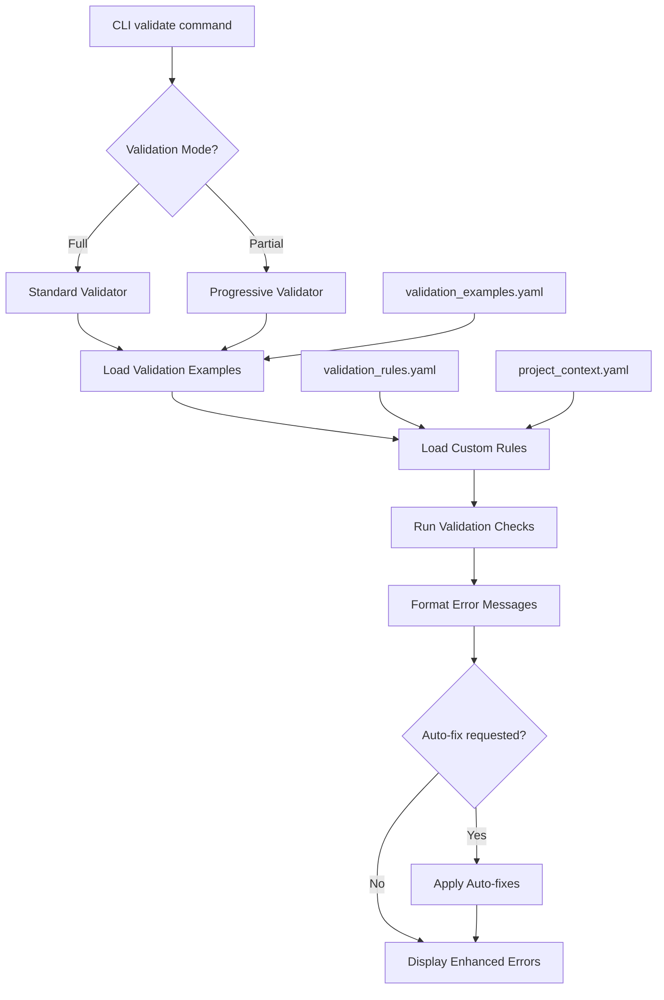

# Implementation Plan: Validation Feedback Improvements

## Specification Reference
- **Spec ID**: SPEC-003
- **Spec File**: specs/003-validation-feedback-improvements/spec-001.md
- **Generated**: 2025-10-06
- **Optimization Focus**: Developer Experience & LLM Integration

## Architecture Overview


## Phase -1: Pre-Implementation Gates
**SDD Compliance Check** - Must pass before coding:
- [x] Specification First - Complete spec with clear requirements (SPEC-003)
- [x] Incremental Planning - Three-phase implementation (3.1, 3.2, 3.3)
- [x] Task Decomposition - Will be detailed in /sp-task
- [x] Quality Assurance - Test-driven approach with >90% coverage target
- [x] Architecture Documentation - Technical decisions documented below

## Phase 0: Foundation & Infrastructure (Est: 1-2 days)

### Objectives
- Set up validation examples database structure
- Create custom validation rule framework
- Establish testing infrastructure for validation components

### Tasks
1. **Create validation_examples.yaml resource file**
   - Define YAML schema for validation examples
   - Add 5 initial examples (acceptance_criteria, requirements, user_stories, executive_summary, problem_statement)
   - Include fields: message, meaning, example, suggestion, help_command, auto_fix
   - Complexity: Simple (1-2 hours)

2. **Create validation_rules.yaml template**
   - Define rule schema with: name, enabled, message, applies_to, severity
   - Add 3 default rules: security_requirement, accessibility_check, performance_consideration
   - Document rule configuration format
   - Complexity: Simple (1-2 hours)

3. **Set up test infrastructure**
   - Create test fixtures for validation (valid/invalid specs)
   - Set up pytest markers for validation tests
   - Create test utilities for validation assertions
   - Complexity: Simple (2-3 hours)

4. **Create progress_calculator.py utility**
   - Implement section completion tracking
   - Create percentage calculation logic
   - Add section status determination (complete/partial/missing)
   - Complexity: Medium (3-4 hours)

### Success Criteria
- [x] Validation examples YAML file exists with 5+ examples
- [x] Validation rules YAML template ready
- [x] Test infrastructure can run validation tests
- [x] Progress calculator correctly calculates completion percentages

### Dependencies
- PyYAML library (already in dependencies)
- Rich library for CLI output (already in dependencies)
- Existing validator.py module

## Phase 1: Actionable Validation Messages (Component 3.1) (Est: 2-3 days)

### Objectives
- Enhance validation error messages with examples and suggestions
- Implement auto-fix functionality for common issues
- Create comprehensive validation examples database

### Tasks

#### 1.1 Enhance Validator Core (validator.py)
- **File**: specpulse/core/validator.py
- **Changes**: +150 lines
- **Tasks**:
  - Add `ValidationExample` dataclass to represent enhanced errors
  - Create `load_validation_examples()` method to parse YAML
  - Modify `_check_section_exists()` to use enhanced messages
  - Add `format_enhanced_error()` method with example, suggestion, help
  - Implement example caching for performance
- **Complexity**: Medium (4-6 hours)
- **Tests**:
  - Test enhanced error message formatting
  - Test example loading from YAML
  - Test error message structure (meaning, example, suggestion)

#### 1.2 Implement Auto-Fix Functionality
- **File**: specpulse/core/validator.py
- **Method**: `auto_fix_validation_issues(spec_path, backup=True)`
- **Tasks**:
  - Parse validation errors to identify fixable issues
  - Create backup before modifications
  - Add missing sections with template placeholders
  - Generate diff report of changes
  - Rollback mechanism if auto-fix fails
- **Complexity**: Medium (5-7 hours)
- **Tests**:
  - Test auto-fix adds missing sections
  - Test backup creation
  - Test rollback on failure
  - Test diff reporting

#### 1.3 Expand Validation Examples Database
- **File**: specpulse/resources/validation_examples.yaml
- **Tasks**:
  - Add 15+ validation examples covering all spec sections
  - Include examples for: acceptance_criteria, user_stories, requirements, technical_constraints, dependencies, risks, success_criteria, etc.
  - Add project-type-specific examples (web-app, api, mobile-app)
  - Version the examples file (v1.0.0)
- **Complexity**: Simple (3-4 hours)
- **Tests**:
  - Validate YAML structure
  - Test example completeness
  - Test example retrieval by key

#### 1.4 CLI Integration for Enhanced Validation
- **File**: specpulse/cli/main.py
- **Tasks**:
  - Add `--fix` flag to validate command
  - Add `--show-examples` flag to see all available examples
  - Update help text for validate command
  - Add `help <topic>` command for validation topics
- **Complexity**: Simple (2-3 hours)
- **Tests**:
  - Test --fix flag invokes auto-fix
  - Test --show-examples displays examples
  - Test help command shows validation guidance

### Success Criteria
- [x] Validation errors include: meaning, example, suggestion, help command
- [x] `specpulse validate 001 --fix` adds missing sections
- [x] Validation examples YAML contains 15+ examples
- [x] Auto-fix creates backups before modifications
- [x] Enhanced error messages are LLM-parseable

### Testing Strategy
- Unit tests for enhanced error formatting
- Integration tests for auto-fix workflow
- Regression tests to ensure backward compatibility
- Performance tests (validation should complete <2 seconds)

## Phase 2: Partial Validation (Component 3.2) (Est: 1-2 days)

### Objectives
- Implement progressive validation for incomplete specs
- Add completion percentage tracking
- Provide smart section suggestions

### Tasks

#### 2.1 Implement Progressive Validator
- **File**: specpulse/core/validator.py
- **Method**: `validate_partial(spec_path) -> ValidationProgress`
- **Tasks**:
  - Create `ValidationProgress` dataclass (completion_pct, section_statuses, next_suggestion)
  - Implement section status calculation (complete/partial/missing)
  - Add section content quality checks (min items, length)
  - Create next section suggestion logic based on spec phase
- **Complexity**: Medium (4-6 hours)
- **Tests**:
  - Test completion percentage calculation
  - Test section status determination
  - Test next section suggestions
  - Test partial validation doesn't fail on incomplete specs

#### 2.2 Section Status Indicators
- **File**: specpulse/utils/progress_calculator.py
- **Tasks**:
  - Implement `calculate_section_status(section_content) -> SectionStatus`
  - Define thresholds for complete vs partial (e.g., min 3 items for requirements)
  - Add section weight configuration (executive summary = 5%, requirements = 15%, etc.)
  - Create visual status indicators (✓ ⚠️ ⭕)
- **Complexity**: Medium (3-4 hours)
- **Tests**:
  - Test section status calculation logic
  - Test threshold configurations
  - Test weighted completion calculation

#### 2.3 Next Section Suggestion Engine
- **File**: specpulse/utils/progress_calculator.py
- **Method**: `suggest_next_section(current_sections) -> str`
- **Tasks**:
  - Define recommended section order (executive → problem → solution → requirements → user_stories → acceptance_criteria)
  - Implement suggestion logic based on completed sections
  - Add context-aware suggestions (if security mentioned, suggest security section)
- **Complexity**: Simple (2-3 hours)
- **Tests**:
  - Test suggestion follows recommended order
  - Test context-aware suggestions
  - Test no suggestion when spec complete

#### 2.4 CLI Integration for Partial Validation
- **File**: specpulse/cli/main.py
- **Tasks**:
  - Add `--partial` flag to validate command
  - Add `--progress` flag to show just completion percentage
  - Format partial validation output with Rich tables
  - Add progress bar visualization
- **Complexity**: Simple (2-3 hours)
- **Tests**:
  - Test --partial flag enables progressive mode
  - Test --progress shows percentage only
  - Test output formatting

### Success Criteria
- [x] `specpulse validate 001 --partial` shows completion percentage
- [x] Section status indicators (✓ ⚠️ ⭕) displayed correctly
- [x] Next section suggestions are relevant and helpful
- [x] Partial validation doesn't fail on incomplete specs
- [x] Progress bar accurately reflects completion

### Testing Strategy
- Unit tests for progress calculation
- Integration tests for partial validation workflow
- Edge case tests (empty spec, single section spec)
- UX tests with sample incomplete specs

## Phase 3: Context-Based Validation Rules (Component 3.3) (Est: 2-3 days)

### Objectives
- Implement custom validation rule engine
- Add project-type-aware validation
- Create CLI for rule management

### Tasks

#### 3.1 Custom Validation Rule Engine
- **File**: specpulse/core/custom_validation.py (new, ~180 lines)
- **Classes**: `ValidationRule`, `RuleEngine`
- **Tasks**:
  - Create `ValidationRule` dataclass (name, enabled, message, applies_to, severity, check_function)
  - Implement `RuleEngine` to load, execute, and manage rules
  - Add rule filtering by project type
  - Implement severity levels (error, warning, info)
  - Create rule execution pipeline
- **Complexity**: Complex (6-8 hours)
- **Tests**:
  - Test rule loading from YAML
  - Test rule filtering by project type
  - Test rule execution
  - Test severity handling

#### 3.2 Project Type Detection
- **File**: specpulse/utils/project_detector.py (new, ~100 lines)
- **Tasks**:
  - Implement project type detection from context.yaml (if exists from v1.7.0)
  - Add fallback detection from file structure (package.json → web-app, requirements.txt → api, etc.)
  - Support manual project type override
  - Cache project type detection results
- **Complexity**: Medium (3-4 hours)
- **Tests**:
  - Test detection from context.yaml
  - Test fallback detection from files
  - Test manual override
  - Test caching

#### 3.3 Rule Manager Utility
- **File**: specpulse/utils/rule_manager.py (new, ~120 lines)
- **Methods**: `list_rules()`, `enable_rule()`, `disable_rule()`, `add_custom_rule()`
- **Tasks**:
  - Implement CRUD operations for validation rules
  - Add rule validation (ensure rule structure is valid)
  - Create rule template generator
  - Implement rule persistence to validation_rules.yaml
- **Complexity**: Medium (4-5 hours)
- **Tests**:
  - Test rule listing
  - Test enable/disable operations
  - Test custom rule creation
  - Test rule template generation

#### 3.4 Default Validation Rules
- **File**: specpulse/resources/validation_rules.yaml
- **Tasks**:
  - Create 5+ default rules for common project types
  - Web-app rules: security_requirement, accessibility_check, performance_requirement
  - API rules: api_documentation, rate_limiting, authentication
  - Mobile-app rules: platform_support, offline_mode, app_store_requirements
  - Document rule customization in comments
- **Complexity**: Simple (2-3 hours)

#### 3.5 CLI Integration for Rule Management
- **File**: specpulse/cli/main.py
- **Commands**: `validation rules list`, `validation rules enable <name>`, `validation rules disable <name>`, `validation rules add <name> --template`
- **Tasks**:
  - Add subcommand group for validation rules
  - Implement list command with Rich table output
  - Implement enable/disable commands
  - Implement add command with interactive prompts
- **Complexity**: Medium (3-4 hours)
- **Tests**:
  - Test rules list command
  - Test enable/disable commands
  - Test add command
  - Test command help text

#### 3.6 Integrate Custom Rules into Validation Pipeline
- **File**: specpulse/core/validator.py
- **Tasks**:
  - Add custom rule execution to `validate()` method
  - Filter rules by project type
  - Format custom rule errors using enhanced error format
  - Add custom rules to validation report
- **Complexity**: Medium (3-4 hours)
- **Tests**:
  - Test custom rules execute during validation
  - Test project type filtering
  - Test custom rule errors formatted correctly

### Success Criteria
- [x] Custom validation rules load from YAML
- [x] Project type detection works for web-app, api, mobile-app
- [x] CLI commands for rule management functional
- [x] Custom rules integrate into validation pipeline
- [x] Default rules provided for common project types
- [x] Rules can be enabled/disabled per project

### Testing Strategy
- Unit tests for rule engine
- Integration tests for full validation with custom rules
- Project type detection tests
- CLI command tests
- Rule persistence tests

## Phase 4: Integration & Testing (Est: 1 day)

### Objectives
- Integrate all three components
- Comprehensive testing
- Performance optimization
- Documentation

### Tasks

#### 4.1 Component Integration
- Ensure actionable messages work with partial validation
- Ensure custom rules work with both full and partial validation
- Test auto-fix doesn't interfere with custom rules
- Verify all components work together seamlessly
- **Complexity**: Medium (3-4 hours)

#### 4.2 Comprehensive Testing
- Run full test suite (target: >90% coverage)
- Add integration tests for complete workflow
- Performance benchmarking (ensure <2 second validation)
- Cross-platform testing (Windows, macOS, Linux)
- **Complexity**: Complex (4-6 hours)

#### 4.3 Performance Optimization
- Profile validation performance
- Optimize example loading (caching)
- Optimize rule execution (early exit for disabled rules)
- Optimize section parsing
- **Complexity**: Medium (3-4 hours)

#### 4.4 Documentation
- Update CLI help text
- Create validation examples documentation
- Document custom rule creation
- Add migration guide from v1.7.0
- **Complexity**: Medium (3-4 hours)

### Success Criteria
- [x] All components integrated successfully
- [x] Test coverage >90%
- [x] Validation completes in <2 seconds
- [x] Documentation complete
- [x] Cross-platform compatibility verified

## Technical Decisions

### Architecture Pattern
- **Pattern**: Layered Architecture with Plugin System
- **Rationale**:
  - Validator core remains stable (backward compatibility)
  - Enhanced errors are pluggable (can be disabled)
  - Custom rules are external configuration (easy to extend)
  - Clear separation of concerns (validation logic, formatting, CLI)

### Technology Stack
- **Language**: Python 3.11+
- **CLI Framework**: Click (existing)
- **Output Formatting**: Rich (existing)
- **Configuration**: PyYAML (existing)
- **Testing**: pytest with coverage plugin (existing)

### Key Design Decisions

1. **YAML for Examples and Rules**
   - **Rationale**: Human-readable, easy to edit, version-controllable, consistent with project config
   - **Alternative Considered**: JSON (less readable), Python dicts (not user-editable)
   - **Trade-off**: YAML parsing overhead (mitigated by caching)

2. **Dataclasses for Validation Types**
   - **Rationale**: Type safety, clear structure, easy serialization, better IDE support
   - **Alternative Considered**: Plain dicts (less type-safe), Pydantic (extra dependency)
   - **Trade-off**: Python 3.7+ required (already met)

3. **Auto-fix is Opt-in**
   - **Rationale**: Safety first, users must explicitly request modifications
   - **Alternative Considered**: Auto-fix by default (too aggressive), prompting (annoying in scripts)
   - **Trade-off**: Extra flag to type (acceptable for safety)

4. **Partial Validation is Separate Mode**
   - **Rationale**: Different use cases (WIP vs final), clear intent, no confusion
   - **Alternative Considered**: Auto-detect (ambiguous), always partial (confusing errors)
   - **Trade-off**: Need to remember --partial flag (documented in help)

5. **Custom Rules are Project-Specific**
   - **Rationale**: Different projects have different needs, opt-in flexibility
   - **Alternative Considered**: Global rules (not flexible), per-spec rules (too granular)
   - **Trade-off**: Configuration overhead (mitigated by defaults)

6. **Example Caching in Memory**
   - **Rationale**: Performance (avoid repeated YAML parsing), examples rarely change
   - **Alternative Considered**: No caching (slower), disk caching (complexity)
   - **Trade-off**: Memory usage (negligible for examples)

### Architecture Decision Records (ADRs)

**ADR-001: Enhanced Error Format Structure**
- **Decision**: Use structured format with meaning, example, suggestion, help
- **Context**: LLMs need clear guidance on fixing validation issues
- **Consequences**: +Better UX, +Clear guidance, -More verbose output
- **Status**: Approved

**ADR-002: Progressive Validation Design**
- **Decision**: Separate --partial mode instead of auto-detection
- **Context**: Different validation needs for WIP vs complete specs
- **Consequences**: +Clear intent, +No ambiguity, -Extra flag
- **Status**: Approved

**ADR-003: Custom Rule Configuration Location**
- **Decision**: Store rules in .specpulse/validation_rules.yaml
- **Context**: Need project-specific, version-controlled configuration
- **Consequences**: +Version control, +Per-project config, -Setup overhead
- **Status**: Approved

## Risk Management

### Identified Risks

1. **Risk: Validation Examples Become Outdated**
   - **Probability**: Medium
   - **Impact**: Medium
   - **Mitigation**:
     - Version examples file (v1.0.0)
     - Add validation for examples file structure
     - Include examples in release testing checklist
     - Document example update process

2. **Risk: Auto-fix Breaks Existing Content**
   - **Probability**: Low
   - **Impact**: High
   - **Mitigation**:
     - Always create backups before auto-fix
     - Make auto-fix append-only (never modify existing)
     - Show diff before applying changes
     - Add rollback command
     - Comprehensive testing with edge cases

3. **Risk: Performance Degradation**
   - **Probability**: Low
   - **Impact**: Medium
   - **Mitigation**:
     - Cache validation examples in memory
     - Optimize YAML parsing (load once)
     - Early exit for disabled custom rules
     - Add performance benchmarks to CI
     - Profile validation pipeline

4. **Risk: Custom Rules Too Complex for Users**
   - **Probability**: Medium
   - **Impact**: Low
   - **Mitigation**:
     - Provide 5+ default rules as examples
     - Create rule template generator
     - Document rule creation with examples
     - Keep rule schema simple
     - Add validation for rule structure

5. **Risk: Backward Compatibility Issues**
   - **Probability**: Low
   - **Impact**: High
   - **Mitigation**:
     - Enhanced validation is opt-in via flags
     - Existing validation behavior unchanged
     - Add regression tests for v1.7.0 behavior
     - Version gate new features
     - Document migration path

## Resource Requirements
- **Team Size**: 1 developer (solo development)
- **Timeline**: 1 week (5-7 working days)
  - Phase 0: 1-2 days
  - Phase 1: 2-3 days
  - Phase 2: 1-2 days
  - Phase 3: 2-3 days
  - Phase 4: 1 day
- **Budget**: N/A (open source)
- **Tools**:
  - Python 3.11+ development environment
  - pytest for testing
  - Git for version control
  - IDE with Python support

## Dependencies

### Internal Dependencies
- Existing validator.py module (will be enhanced)
- Project context system from v1.7.0 (for project type detection)
- CLI framework (Click)
- Template system (Jinja2)

### External Dependencies
- PyYAML (existing) - for YAML parsing
- Rich (existing) - for CLI output formatting
- dataclasses (Python 3.7+) - for type-safe data structures

### Blocking Dependencies
- None (all dependencies already in project)

## Monitoring & Success Metrics

### Performance Metrics
- Validation completion time: <2 seconds for typical specs
- Memory usage: <50MB for validation operations
- Test execution time: <30 seconds for full suite

### Quality Metrics
- Test coverage: >90% for new validation code
- Bug reports: <5 issues in first month after release
- Validation accuracy: 0% false positives for auto-fix

### User Experience Metrics
- Time to fix validation issue: 50% reduction (from 5 min to 2.5 min)
- LLM iterations to pass validation: 30% reduction (from 3 to 2)
- User satisfaction: Positive feedback on enhanced errors

### Business Metrics
- Spec completion time: 20% faster (better validation guidance)
- Spec quality: Fewer missing sections after validation
- Adoption: 80% of users use enhanced validation within 2 weeks

## Testing Strategy

### Unit Tests (Target: 100+ tests)
- Enhanced error formatting
- Example loading and caching
- Auto-fix logic
- Progress calculation
- Section status determination
- Custom rule execution
- Rule management operations

### Integration Tests (Target: 30+ tests)
- Full validation workflow with enhanced errors
- Partial validation workflow
- Auto-fix workflow with backup/rollback
- Custom rules integration
- CLI command integration

### Performance Tests (Target: 10+ benchmarks)
- Validation speed benchmarks
- Memory usage profiling
- Example loading performance
- Rule execution performance

### Regression Tests (Target: 20+ tests)
- v1.7.0 validation behavior preserved
- Backward compatibility checks
- No breaking changes in validator API

### Cross-Platform Tests
- Windows (Git Bash)
- macOS
- Linux

## Migration from v1.7.0

### For Users
1. Update SpecPulse to v1.8.0
2. Run `specpulse validate --help` to see new flags
3. (Optional) Create `.specpulse/validation_rules.yaml` for custom rules
4. (Optional) Set project type in `.specpulse/project_context.yaml`
5. Try `specpulse validate 001 --partial` for work-in-progress specs
6. Try `specpulse validate 001 --fix` to auto-add missing sections

### For Developers
1. Enhanced validation is backward compatible
2. Existing `validate()` calls work unchanged
3. New features available via flags: `--partial`, `--fix`, `--show-examples`
4. Custom rules require `.specpulse/validation_rules.yaml` file
5. No breaking API changes in validator module

### Breaking Changes
- None (all new features are opt-in)

## Notes

### Implementation Order Rationale
1. **Phase 0 first**: Foundation must be solid (examples YAML, test infrastructure)
2. **Phase 1 next**: Most impactful feature (actionable errors help 100% of users)
3. **Phase 2 then**: Enables incremental workflow (builds on Phase 1 error formatting)
4. **Phase 3 last**: Advanced feature (requires stable validator core)

### Code Organization
```
specpulse/
├── core/
│   ├── validator.py (+250 lines)
│   └── custom_validation.py (new, 180 lines)
├── utils/
│   ├── progress_calculator.py (new, 80 lines)
│   ├── rule_manager.py (new, 120 lines)
│   └── project_detector.py (new, 100 lines)
├── resources/
│   ├── validation_examples.yaml (new, 200 lines)
│   └── validation_rules.yaml (new, 100 lines)
└── cli/
    └── main.py (+150 lines for new commands)
```

### Key Files to Review
- `specpulse/core/validator.py` - Core validation logic
- `specpulse/resources/validation_examples.yaml` - Examples database
- `.specpulse/validation_rules.yaml` - Custom rules template

### Open Questions (from Spec)
1. **Auto-fix confirmation**: Decision → Use `--fix` flag (explicit opt-in, no confirmation needed)
2. **Minimum completion percentage**: Decision → 60% to suggest moving to planning phase
3. **Regex patterns in rules**: Decision → Phase 1 supports section presence only; regex patterns deferred to v1.9.0
